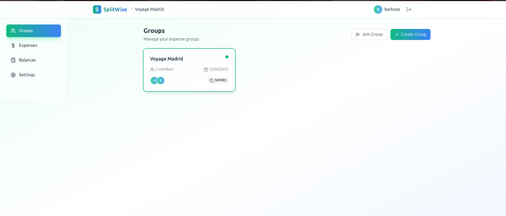
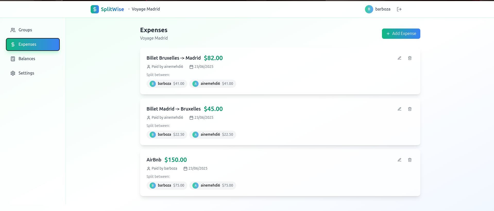
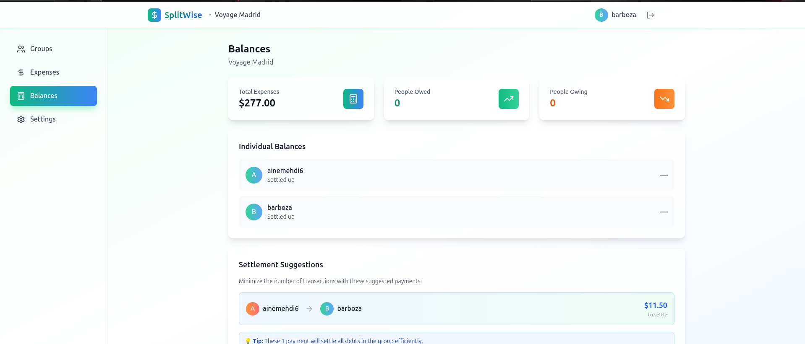
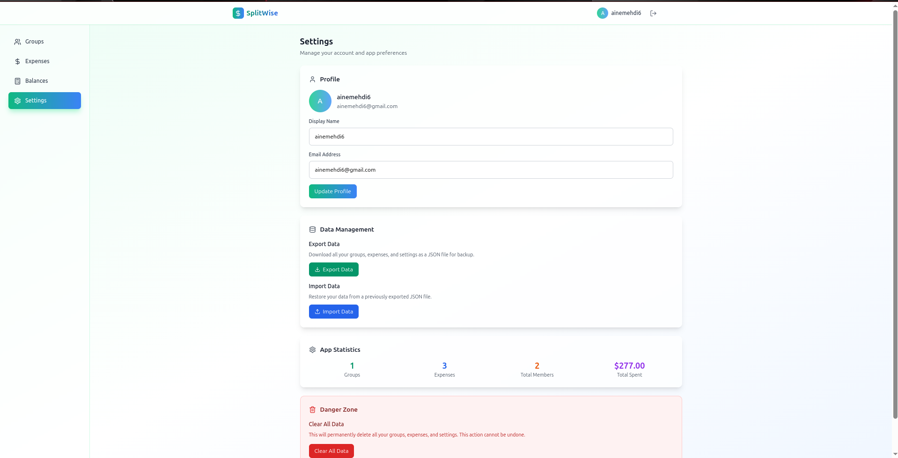

# SplitWise - Expense Splitting Made Simple

A beautiful, responsive web application for managing and splitting shared expenses among groups of friends, family, or colleagues. Built with React, TypeScript, and Tailwind CSS.






## ✨ Features

### 🔐 User Authentication
- **Quick Sign Up/Login**: Simple email-based authentication
- **Guest Access**: Try the app without creating an account
- **Profile Management**: Update your display name and email

### 👥 Group Management
- **Create Groups**: Set up expense groups for trips, events, or shared living
- **Invite System**: Share 6-character invite codes to add members
- **Visual Member Display**: See all group participants at a glance
- **Multiple Groups**: Manage unlimited expense groups simultaneously

### 💰 Expense Tracking
- **Add Expenses**: Record purchases with description, amount, date, and payer
- **Flexible Splitting**: Choose between equal splits or custom amounts
- **Edit & Delete**: Full CRUD operations for expense management
- **Visual Expense History**: Clean timeline view of all group expenses

### 📊 Balance Calculations
- **Real-time Balances**: Automatic calculation of who owes what
- **Settlement Suggestions**: Optimized payment recommendations to minimize transactions
- **Visual Indicators**: Color-coded balance displays (green for owed, orange for owing)
- **Summary Statistics**: Total expenses, creditors, and debtors overview

### 📱 User Experience
- **Mobile-First Design**: Optimized for smartphones and tablets
- **Responsive Layout**: Seamless experience across all screen sizes
- **Smooth Animations**: Polished micro-interactions and transitions
- **Intuitive Navigation**: Bottom navigation on mobile, sidebar on desktop

### 💾 Data Management
- **Local Storage**: All data stored securely in your browser
- **Export/Import**: Backup and restore your data as JSON files
- **Data Statistics**: View usage statistics and app metrics

## 🚀 Getting Started

### Prerequisites
- Node.js (version 16 or higher)
- npm or yarn package manager

### Installation

1. **Clone the repository**
   ```bash
   git clone <repository-url>
   cd splitwise-app
   ```

2. **Install dependencies**
   ```bash
   npm install
   ```

3. **Start the development server**
   ```bash
   npm run dev
   ```

4. **Open your browser**
   Navigate to `http://localhost:5173` to view the application

### Building for Production

```bash
npm run build
```

The built files will be in the `dist` directory, ready for deployment.

## 🎯 How to Use

### Getting Started
1. **Sign Up or Continue as Guest**: Create an account or try the app without registration
2. **Create Your First Group**: Set up a group for your shared expenses
3. **Invite Members**: Share the 6-character invite code with friends
4. **Start Adding Expenses**: Record shared purchases and split them fairly

### Managing Expenses
1. **Add Expense**: Click the "+" button to record a new expense
2. **Choose Payer**: Select who paid for the expense
3. **Select Participants**: Choose who should split the cost
4. **Split Options**: Use equal split or set custom amounts
5. **Save**: The expense is automatically added and balances updated

### Viewing Balances
1. **Navigate to Balances**: See who owes money and who should receive it
2. **Settlement Suggestions**: Follow the optimized payment recommendations
3. **Track Progress**: Monitor as debts are settled over time

### Data Management
1. **Export Data**: Download your data for backup (Settings → Export Data)
2. **Import Data**: Restore from a previous backup (Settings → Import Data)
3. **Clear Data**: Reset the app completely if needed (Settings → Danger Zone)

## 🛠️ Technical Details

### Tech Stack
- **Frontend**: React 18 with TypeScript
- **Styling**: Tailwind CSS with custom design system
- **Icons**: Lucide React icon library
- **Build Tool**: Vite for fast development and building
- **State Management**: React Context API with useReducer
- **Data Persistence**: Browser localStorage with JSON serialization

### Architecture
- **Component-Based**: Modular React components for maintainability
- **Context Pattern**: Centralized state management for app data
- **Custom Hooks**: Reusable logic for common operations
- **Utility Functions**: Pure functions for calculations and formatting
- **TypeScript**: Full type safety throughout the application

### Key Algorithms
- **Balance Calculation**: Tracks payments and splits to determine net balances
- **Settlement Optimization**: Minimizes the number of transactions needed to settle all debts
- **Equal Splitting**: Handles rounding to ensure total splits equal the expense amount

## 📊 Features in Detail

### Balance Calculation Algorithm
The app uses a sophisticated balance calculation system:
1. **Track Payments**: Record who paid for each expense
2. **Calculate Shares**: Determine each person's portion of expenses
3. **Net Balances**: Subtract shares from payments to get net position
4. **Settlement Optimization**: Use a greedy algorithm to minimize transactions

### Data Structure
```typescript
interface Expense {
  id: string;
  groupId: string;
  description: string;
  amount: number;
  paidBy: string;
  date: string;
  participants: ExpenseParticipant[];
  createdAt: string;
  updatedAt: string;
}
```

## 🔄 Version History

### v1.0.0 (Current)
- Initial release with core functionality
- Group management and expense tracking
- Balance calculations and settlement suggestions
- Mobile-responsive design

---

**Made with ❤️ for splitting expenses fairly and keeping friendships intact!**